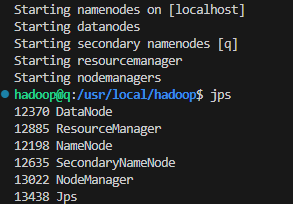
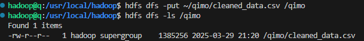
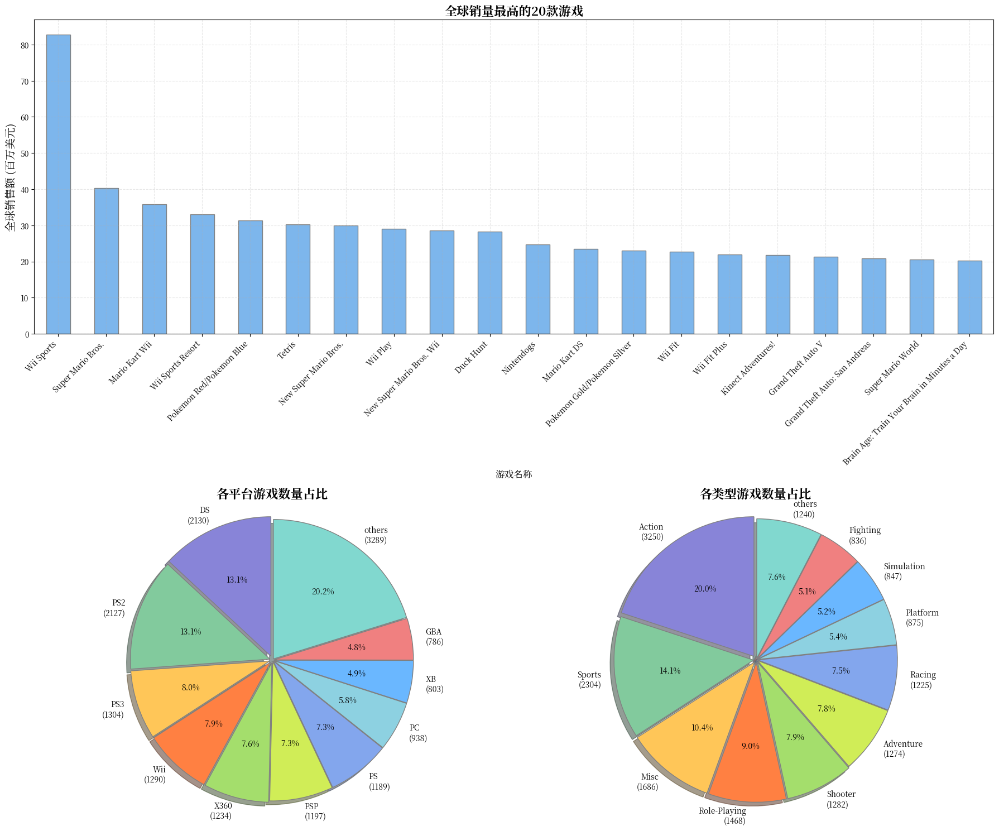
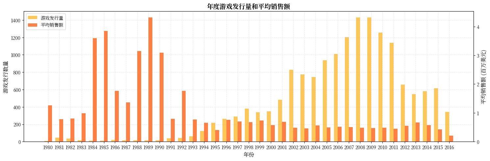
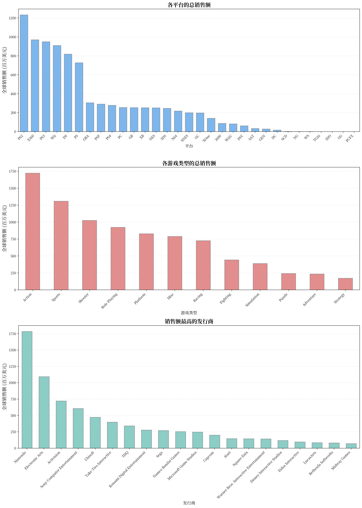
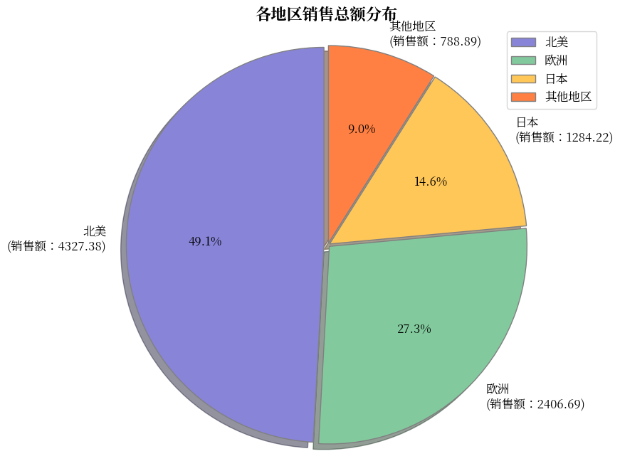
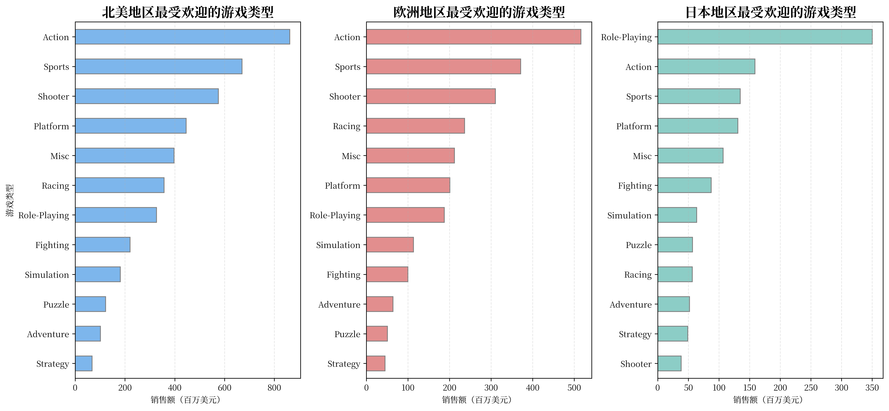
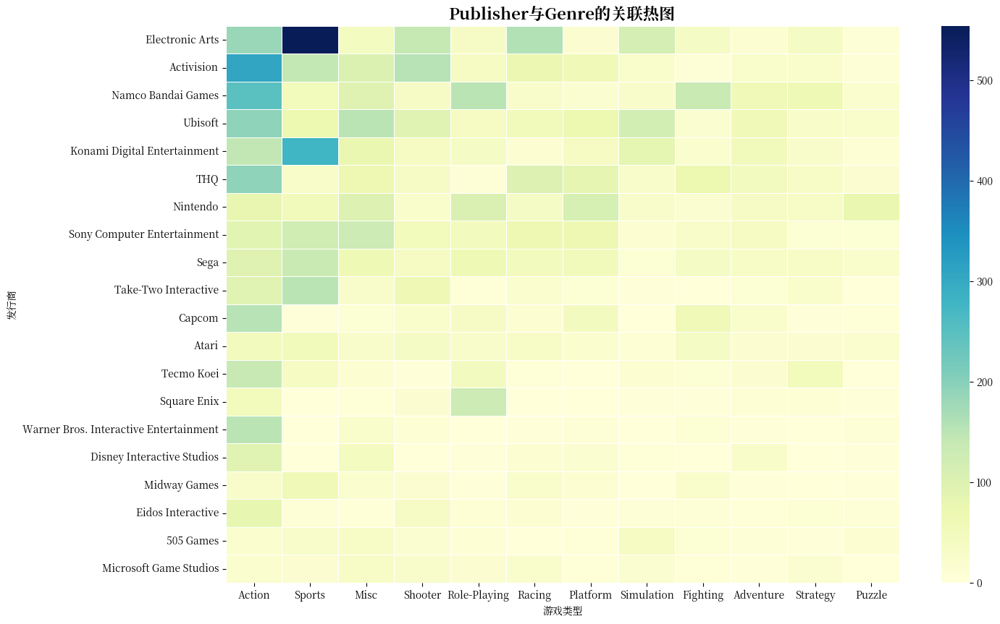
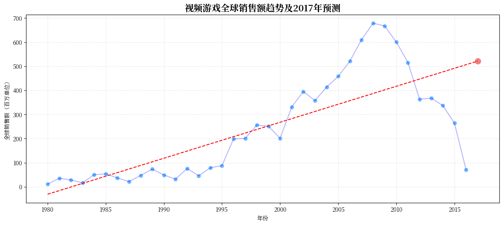

**Author:** 齐骋之
**Date:** 2025-4-17
**GitHub:** [OrangJu](https://github.com/OrangJu/qimo)
```python
# 导入数据集
import pandas as pd
import numpy as np
import matplotlib.pyplot as plt
import seaborn as sns

# 读取数据集
data = pd.read_csv('vgsales.csv')
data.info()
```

    <class 'pandas.core.frame.DataFrame'>
    RangeIndex: 16598 entries, 0 to 16597
    Data columns (total 11 columns):
     #   Column        Non-Null Count  Dtype  
    ---  ------        --------------  -----  
     0   Rank          16598 non-null  int64  
     1   Name          16598 non-null  object 
     2   Platform      16598 non-null  object 
     3   Year          16327 non-null  float64
     4   Genre         16598 non-null  object 
     5   Publisher     16540 non-null  object 
     6   NA_Sales      16598 non-null  float64
     7   EU_Sales      16598 non-null  float64
     8   JP_Sales      16598 non-null  float64
     9   Other_Sales   16598 non-null  float64
     10  Global_Sales  16598 non-null  float64
    dtypes: float64(6), int64(1), object(4)
    memory usage: 1.4+ MB


```python
#检查是否有缺失值
data.isna().any()
data.loc[(data['Year'].isna()) | (data['Publisher'].isna()),['Year','Publisher']].info()
```

    <class 'pandas.core.frame.DataFrame'>
    Index: 307 entries, 179 to 16553
    Data columns (total 2 columns):
     #   Column     Non-Null Count  Dtype  
    ---  ------     --------------  -----  
     0   Year       36 non-null     float64
     1   Publisher  249 non-null    object 
    dtypes: float64(1), object(1)
    memory usage: 7.2+ KB


```python
#缺失值不多，直接删去，并重新计算排名
data = data.loc[~((data['Year'].isna()) | (data['Publisher'].isna())),:]
data['Rank'] = data['Rank'].rank().astype(int)
data['Year'] = data['Year'].astype(int)
#保存清洗后数据集
data.to_csv('cleaned_data.csv', index=False)
```

启动hdfs


导入数据到hdfs



```python
# 字体设置
plt.rcParams['font.sans-serif'] = ['Noto Serif CJK JP']  
# 设置颜色方案，与示例图保持一致
colors = ['#8884d8', '#82ca9d', '#ffc658', '#ff8042', '#a4de6c', 
          '#d0ed57', '#83a6ed', '#8dd1e1', '#6ab7ff', '#f08080','#81d8cf']
#导入findspark
import findspark
findspark.init('/usr/local/spark')  # 确保 Spark 环境正确
from pyspark.sql import SparkSession
import pyspark.sql.functions as F
import logging
# 创建 SparkSession
spark = SparkSession.builder \
    .appName("PySpark Jupyter") \
    .config("spark.ui.showConsoleProgress", "false") \
    .getOrCreate()
# 获取 SparkContext
sc = spark.sparkContext
# 设置 PySpark 日志级别
sc.setLogLevel("ERROR")
# 获取 log4j 日志对象
log4j_logger = sc._jvm.org.apache.log4j
log4j_logger.LogManager.getRootLogger().setLevel(log4j_logger.Level.ERROR)
# 设置 Python 端的日志级别（避免 py4j 产生过多 INFO 日志）
logging.getLogger("py4j").setLevel(logging.ERROR)
print("PySpark 环境已配置，日志级别已设置为 ERROR")
# 测试是否工作正常
print(f"Spark 版本: {sc.version}")
test_rdd = sc.parallelize([1, 2, 3, 4, 5])
print(test_rdd.map(lambda x: x * 2).collect())
```

    PySpark 环境已配置，日志级别已设置为 ERROR
    Spark 版本: 3.4.4
    [2, 4, 6, 8, 10]


```python
#使用spark.read.csv()直接读取CSV文件
sdf = spark.read.csv('hdfs://localhost:9000/qimo/cleaned_data.csv', header=True, inferSchema=True)
# 创建视图以进行SQL操作
print("数据结构:")
sdf.printSchema()
sdf.createOrReplaceTempView("df")
```

    数据结构:
    root
     |-- Rank: integer (nullable = true)
     |-- Name: string (nullable = true)
     |-- Platform: string (nullable = true)
     |-- Year: integer (nullable = true)
     |-- Genre: string (nullable = true)
     |-- Publisher: string (nullable = true)
     |-- NA_Sales: double (nullable = true)
     |-- EU_Sales: double (nullable = true)
     |-- JP_Sales: double (nullable = true)
     |-- Other_Sales: double (nullable = true)
     |-- Global_Sales: double (nullable = true)
    


```python
result = spark.sql("SELECT * FROM df LIMIT 5")
result.show()
```

    +----+--------------------+--------+----+------------+---------+--------+--------+--------+-----------+------------+
    |Rank|                Name|Platform|Year|       Genre|Publisher|NA_Sales|EU_Sales|JP_Sales|Other_Sales|Global_Sales|
    +----+--------------------+--------+----+------------+---------+--------+--------+--------+-----------+------------+
    |   1|          Wii Sports|     Wii|2006|      Sports| Nintendo|   41.49|   29.02|    3.77|       8.46|       82.74|
    |   2|   Super Mario Bros.|     NES|1985|    Platform| Nintendo|   29.08|    3.58|    6.81|       0.77|       40.24|
    |   3|      Mario Kart Wii|     Wii|2008|      Racing| Nintendo|   15.85|   12.88|    3.79|       3.31|       35.82|
    |   4|   Wii Sports Resort|     Wii|2009|      Sports| Nintendo|   15.75|   11.01|    3.28|       2.96|        33.0|
    |   5|Pokemon Red/Pokem...|      GB|1996|Role-Playing| Nintendo|   11.27|    8.89|   10.22|        1.0|       31.37|
    +----+--------------------+--------+----+------------+---------+--------+--------+--------+-----------+------------+
    


```python
# 3. 描述性统计分析
print("\n销售数据基本统计量:")
sdf.select("NA_Sales", "EU_Sales", "JP_Sales", "Other_Sales", "Global_Sales").summary().show()
```

    
    销售数据基本统计量:
    +-------+-------------------+-------------------+-------------------+-------------------+------------------+
    |summary|           NA_Sales|           EU_Sales|           JP_Sales|        Other_Sales|      Global_Sales|
    +-------+-------------------+-------------------+-------------------+-------------------+------------------+
    |  count|              16287|              16287|              16287|              16287|             16287|
    |   mean|0.26569533984161153|0.14776754466755918|0.07884938908331204|0.04843679007796921|0.5410222877141792|
    | stddev| 0.8225252142803904| 0.5093602084265009|0.31191601826952464|0.19010493697165343| 1.567519581894777|
    |    min|                0.0|                0.0|                0.0|                0.0|              0.01|
    |    25%|                0.0|                0.0|                0.0|                0.0|              0.06|
    |    50%|               0.08|               0.02|                0.0|               0.01|              0.17|
    |    75%|               0.24|               0.11|               0.04|               0.04|              0.48|
    |    max|              41.49|              29.02|              10.22|              10.57|             82.74|
    +-------+-------------------+-------------------+-------------------+-------------------+------------------+
    


```python
# 全球销量最高的10款游戏
print("\n全球销量最高的10款游戏:")
top_games = sdf.select("Name", "Platform", "Year", "Genre", "Publisher", "Global_Sales")\
   .orderBy("Global_Sales", ascending=False)\
   .limit(20)
top_games.show(10)

# 游戏平台分布
print("\n各平台游戏数量:")
platform_counts = sdf.groupBy("Platform").count().orderBy("count", ascending=False)
platform_counts.show()

# 游戏类型分布
print("\n各类型游戏数量:")
genre_counts = sdf.groupBy("Genre").count().orderBy("count", ascending=False)
genre_counts.show()
```

    
    全球销量最高的10款游戏:
    +--------------------+--------+----+------------+---------+------------+
    |                Name|Platform|Year|       Genre|Publisher|Global_Sales|
    +--------------------+--------+----+------------+---------+------------+
    |          Wii Sports|     Wii|2006|      Sports| Nintendo|       82.74|
    |   Super Mario Bros.|     NES|1985|    Platform| Nintendo|       40.24|
    |      Mario Kart Wii|     Wii|2008|      Racing| Nintendo|       35.82|
    |   Wii Sports Resort|     Wii|2009|      Sports| Nintendo|        33.0|
    |Pokemon Red/Pokem...|      GB|1996|Role-Playing| Nintendo|       31.37|
    |              Tetris|      GB|1989|      Puzzle| Nintendo|       30.26|
    |New Super Mario B...|      DS|2006|    Platform| Nintendo|       30.01|
    |            Wii Play|     Wii|2006|        Misc| Nintendo|       29.02|
    |New Super Mario B...|     Wii|2009|    Platform| Nintendo|       28.62|
    |           Duck Hunt|     NES|1984|     Shooter| Nintendo|       28.31|
    +--------------------+--------+----+------------+---------+------------+
    only showing top 10 rows
    
    
    各平台游戏数量:
    +--------+-----+
    |Platform|count|
    +--------+-----+
    |      DS| 2130|
    |     PS2| 2127|
    |     PS3| 1304|
    |     Wii| 1290|
    |    X360| 1234|
    |     PSP| 1197|
    |      PS| 1189|
    |      PC|  938|
    |      XB|  803|
    |     GBA|  786|
    |      GC|  542|
    |     3DS|  499|
    |     PSV|  408|
    |     PS4|  335|
    |     N64|  316|
    |    SNES|  239|
    |    XOne|  213|
    |     SAT|  173|
    |    WiiU|  143|
    |    2600|  116|
    +--------+-----+
    only showing top 20 rows
    
    
    各类型游戏数量:
    +------------+-----+
    |       Genre|count|
    +------------+-----+
    |      Action| 3250|
    |      Sports| 2304|
    |        Misc| 1686|
    |Role-Playing| 1468|
    |     Shooter| 1282|
    |   Adventure| 1274|
    |      Racing| 1225|
    |    Platform|  875|
    |  Simulation|  847|
    |    Fighting|  836|
    |    Strategy|  670|
    |      Puzzle|  570|
    +------------+-----+
    


```python
top_games_df = top_games.toPandas()
platform_counts_df = platform_counts.toPandas()
genre_counts_df = genre_counts.toPandas()
# 1. 全球销量最高的10款游戏
fig = plt.figure(figsize=(18, 15), dpi=100)
ax1 = plt.subplot2grid((2, 2), (0, 0), colspan=2)
bars = sns.barplot(x='Name', y='Global_Sales', data=top_games_df, color=colors[8], ax=ax1, width=0.5)
ax1.set_title('全球销量最高的20款游戏', fontsize=16, fontweight='bold')
ax1.set_xlabel('游戏名称', fontsize=12)
ax1.set_xticks(top_games_df['Name'])
ax1.set_xticklabels(top_games_df['Name'], rotation=45, ha='right')
ax1.set_ylabel('全球销售额 (百万美元)', fontsize=14)
for i in bars.patches:
    i.set_edgecolor('Grey')
ax1.grid(True, linestyle='--', alpha=0.3)

# 2. 各平台游戏数量
ax2 = plt.subplot2grid((2, 2), (1, 0))
# 处理前10个平台，将其余归为"其他"
top_10_platforms = platform_counts_df.iloc[:10]
other_platforms_count = platform_counts_df.iloc[10:]['count'].sum()

# 如果有"其他"类别，则添加到数据中
if other_platforms_count > 0:
    platform_data = top_10_platforms['count'].tolist() + [other_platforms_count]
    platform_labels = top_10_platforms['Platform'].tolist() + ['others']
else:
    platform_data = top_10_platforms['count'].tolist()
    platform_labels = top_10_platforms['Platform'].tolist()

labels = [f"{platform_labels[i]}\n({platform_data[i]})" for i in range(len(platform_labels))]
explode = (0.03, 0.02, 0.02, 0.02, 0.02, 0.01, 0.01, 0.01, 0.01, 0.01, 0.01)
wedges, texts, autotexts = ax2.pie(
    platform_data,
    labels=labels,
    autopct='%1.1f%%',
    startangle=90,
    colors=colors,
    shadow=True,
    explode=explode,
    wedgeprops={'edgecolor': 'grey'}
)
ax2.set_title('各平台游戏数量占比', fontsize=16, fontweight='bold')
ax2.axis('equal')  # 确保饼图是圆形的

# 3. 各类型游戏数量
ax3 = plt.subplot2grid((2, 2), (1, 1))
# 处理前10个类型，将其余归为"其他"
top_10_genres = genre_counts_df.iloc[:10]
other_genres_count = genre_counts_df.iloc[10:]['count'].sum()

# 如果有"其他"类别，则添加到数据中
if other_genres_count > 0:
    genre_data = top_10_genres['count'].tolist() + [other_genres_count]
    genre_labels = top_10_genres['Genre'].tolist() + ['others']
else:
    genre_data = top_10_genres['count'].tolist()
    genre_labels = top_10_genres['Genre'].tolist()

labels = [f"{genre_labels[i]}\n({genre_data[i]})" for i in range(len(genre_labels))]
ax3.pie(
    genre_data,
    labels=labels,
    explode=explode,
    autopct='%1.1f%%',
    startangle=90,
    colors=colors,
    shadow=True,
    wedgeprops={'edgecolor': 'grey'}
)
ax3.set_title('各类型游戏数量占比', fontsize=16, fontweight='bold')
ax3.axis('equal')  # 确保饼图是圆形的

# 调整布局
plt.tight_layout()
plt.savefig('photo/全球游戏销量和分布分析.png', bbox_inches='tight', dpi=300)
plt.show()
```


    

    


```python
# 4. 趋势分析
# 按年份统计游戏发行量和平均销售额
print("\n年度游戏发行量和平均销售额:")
yearly_stats = sdf.groupBy("Year") \
    .agg(
        F.count("Name").alias("Game_Count"),
        F.round(F.avg("Global_Sales"), 2).alias("Avg_Global_Sales")
    ) \
    .orderBy("Year", ascending=True)
yearly_stats.show()
```

    
    年度游戏发行量和平均销售额:
    +----+----------+----------------+
    |Year|Game_Count|Avg_Global_Sales|
    +----+----------+----------------+
    |1980|         9|            1.26|
    |1981|        46|            0.78|
    |1982|        36|             0.8|
    |1983|        17|            0.99|
    |1984|        14|             3.6|
    |1985|        14|            3.85|
    |1986|        21|            1.77|
    |1987|        16|            1.36|
    |1988|        15|            3.15|
    |1989|        17|            4.32|
    |1990|        16|            3.09|
    |1991|        41|            0.79|
    |1992|        43|            1.77|
    |1993|        60|            0.77|
    |1994|       121|            0.65|
    |1995|       219|             0.4|
    |1996|       263|            0.76|
    |1997|       289|             0.7|
    |1998|       379|            0.68|
    |1999|       338|            0.74|
    +----+----------+----------------+
    only showing top 20 rows
    


```python
yearly_stats_pd = yearly_stats.toPandas()
# 创建图形
fig, ax1 = plt.subplots(figsize=(15, 5), dpi=100)
x = np.arange(len(yearly_stats_pd['Year']))
width = 0.35  # 柱子的宽度

# 第一个y轴：游戏发行量
bars1 = ax1.bar(x - width/2, yearly_stats_pd['Game_Count'], width, label='游戏发行量', color=colors[2])
ax1.set_ylabel('游戏发行数量', fontsize=12)
ax1.set_xlabel('年份', fontsize=12)
ax1.set_title('年度游戏发行量和平均销售额', fontsize=14, fontweight='bold')
ax1.set_xticks(x)
ax1.set_xticklabels(yearly_stats_pd['Year'])

# 创建第二个y轴：平均销售额
ax2 = ax1.twinx()
bars2 = ax2.bar(x + width/2, yearly_stats_pd['Avg_Global_Sales'], width, label='平均销售额', color=colors[3])
ax2.set_ylabel('平均销售额 (百万美元)', fontsize=12)

# 添加图例
handles1, labels1 = ax1.get_legend_handles_labels()
handles2, labels2 = ax2.get_legend_handles_labels()
ax1.legend(handles1 + handles2, labels1 + labels2, loc='upper left')

# 添加网格线
ax1.grid(True, linestyle='--', alpha=0.3)
plt.tight_layout()
plt.savefig('photo/年度发行量和销售额趋势.png', bbox_inches='tight', dpi=300)
plt.show()

```


    

    


```python
#使用sql语句查询数据
# 各平台的总销售额
print("\n各平台的总销售额:")
platform_sales = spark.sql("select Platform, round(sum(Global_Sales),2) as Platform_Sales from df group by Platform order by Platform_Sales desc")
platform_sales.show()

# 各游戏类型的总销售额
print("\n各游戏类型的总销售额:")
genre_sales = spark.sql("select Genre, round(sum(Global_Sales),2) as Genre_Sales from df group by Genre order by Genre_Sales desc")
genre_sales.show()

# 各发行商的总销售额 (Top 15)
print("\n销售额最高的15家发行商:")
publisher_sales = spark.sql("select Publisher, round(sum(Global_Sales),2) as Publisher_Sales from df group by Publisher order by Publisher_Sales desc")
publisher_sales.show(15)

```

    
    各平台的总销售额:
    +--------+--------------+
    |Platform|Platform_Sales|
    +--------+--------------+
    |     PS2|       1233.46|
    |    X360|         969.6|
    |     PS3|        949.35|
    |     Wii|        909.81|
    |      DS|        818.62|
    |      PS|        727.39|
    |     GBA|        305.62|
    |     PSP|        291.71|
    |     PS4|        278.07|
    |      PC|         254.7|
    |      GB|        254.42|
    |      XB|        252.09|
    |     NES|        251.07|
    |     3DS|        246.27|
    |     N64|        218.21|
    |    SNES|        200.05|
    |      GC|        197.14|
    |    XOne|        141.06|
    |    2600|         86.57|
    |    WiiU|         81.86|
    +--------+--------------+
    only showing top 20 rows
    
    
    各游戏类型的总销售额:
    +------------+-----------+
    |       Genre|Genre_Sales|
    +------------+-----------+
    |      Action|    1722.83|
    |      Sports|    1309.24|
    |     Shooter|     1026.2|
    |Role-Playing|     923.79|
    |    Platform|     829.13|
    |        Misc|     789.87|
    |      Racing|     726.76|
    |    Fighting|     444.05|
    |  Simulation|     389.69|
    |      Puzzle|     242.21|
    |   Adventure|     234.59|
    |    Strategy|     173.27|
    +------------+-----------+
    
    
    销售额最高的15家发行商:
    +--------------------+---------------+
    |           Publisher|Publisher_Sales|
    +--------------------+---------------+
    |            Nintendo|        1784.43|
    |     Electronic Arts|        1093.39|
    |          Activision|         721.41|
    |Sony Computer Ent...|         607.28|
    |             Ubisoft|         473.25|
    |Take-Two Interactive|          399.3|
    |                 THQ|         340.44|
    |Konami Digital En...|         278.56|
    |                Sega|         270.66|
    |  Namco Bandai Games|         253.65|
    |Microsoft Game St...|         245.79|
    |              Capcom|         199.95|
    |               Atari|         146.77|
    |         Square Enix|         144.73|
    |Warner Bros. Inte...|         142.34|
    +--------------------+---------------+
    only showing top 15 rows
    


```python
platform_sales_df = platform_sales.toPandas()
genre_sales_df = genre_sales.toPandas()
publisher_sales_df = publisher_sales.toPandas()
# 1. 各平台的总销售额
fig = plt.figure(figsize=(15, 21), dpi=200)
ax1 = plt.subplot2grid((3, 2), (0, 0), colspan=2)
bars = sns.barplot(x='Platform', y='Platform_Sales', data=platform_sales_df, color=colors[8], ax=ax1, width=0.7)
ax1.set_title('各平台的总销售额', fontsize=16, fontweight='bold')
ax1.set_xlabel('平台', fontsize=12)
ax1.set_ylabel('全球销售额 (百万美元)', fontsize=14)
ax1.set_xticks(platform_sales_df['Platform'])
ax1.set_xticklabels(platform_sales_df['Platform'], rotation=45, ha='right')
for i in bars.patches:
    i.set_edgecolor('Grey')
ax1.grid(axis='y', linestyle='--', alpha=0.3)

# 2. 各游戏类型的总销售额
ax2 = plt.subplot2grid((3, 2), (1, 0), colspan=2)
bars = sns.barplot(x='Genre', y='Genre_Sales', data=genre_sales_df, color=colors[9], ax=ax2, width=0.5)
ax2.set_title('各游戏类型的总销售额', fontsize=16, fontweight='bold')
ax2.set_xlabel('游戏类型', fontsize=12)
ax2.set_ylabel('全球销售额 (百万美元)', fontsize=14)
ax2.set_xticks(genre_sales_df['Genre'])
ax2.set_xticklabels(genre_sales_df['Genre'], rotation=45, ha='right')
for i in bars.patches:
    i.set_edgecolor('Grey')
ax2.grid(axis='y', linestyle='--', alpha=0.3)

# 3. 销售额最高的15家发行商
ax3 = plt.subplot2grid((3, 2), (2, 0), colspan=2)
bars = sns.barplot(x='Publisher', y='Publisher_Sales', data=publisher_sales_df.iloc[:20,:], color=colors[10], ax=ax3, width=0.6)
ax3.set_title('销售额最高的发行商', fontsize=16, fontweight='bold')
ax3.set_ylabel('全球销售额 (百万美元)', fontsize=14)
ax3.set_xlabel('发行商', fontsize=12)
ax3.set_xticks(publisher_sales_df.iloc[:20,:]['Publisher'])
ax3.set_xticklabels(publisher_sales_df.iloc[:20,:]['Publisher'], rotation=45, ha='right')
for i in bars.patches:
    i.set_edgecolor('Grey')
ax3.grid(axis='y', linestyle='--', alpha=0.3)
plt.tight_layout()
plt.savefig('photo/平台类型和发行商销售分析.png', bbox_inches='tight', dpi=300)
plt.show()
```


    

    


```python
# 6. 地区差异分析
# 各地区销售总额
print("\n各地区销售总额:")
region_sales = spark.sql("select round(sum(NA_Sales), 2) as North_America, round(sum(EU_Sales), 2) as Europe, round(sum(JP_Sales), 2) as Japan, round(sum(Other_Sales), 2) as Other_Regions from df")
region_sales.show()

# 各地区最受欢迎的游戏类型
print("\n北美地区最受欢迎的游戏类型:")
na_genre = spark.sql("select Genre, round(sum(NA_Sales), 2) as NA_Total_Sales from df group by Genre order by NA_Total_Sales desc")
na_genre.show()

print("\n欧洲地区最受欢迎的游戏类型:")
eu_genre = spark.sql("select Genre, round(sum(EU_Sales), 2) as EU_Total_Sales from df group by Genre order by EU_Total_Sales desc")
eu_genre.show()


print("\n日本地区最受欢迎的游戏类型:")
jp_genre = spark.sql("select Genre, round(sum(JP_Sales), 2) as JP_Total_Sales from df group by Genre order by JP_Total_Sales desc")
jp_genre.show()
```

    
    各地区销售总额:
    +-------------+-------+-------+-------------+
    |North_America| Europe|  Japan|Other_Regions|
    +-------------+-------+-------+-------------+
    |      4327.38|2406.69|1284.22|       788.89|
    +-------------+-------+-------+-------------+
    
    
    北美地区最受欢迎的游戏类型:
    +------------+--------------+
    |       Genre|NA_Total_Sales|
    +------------+--------------+
    |      Action|        861.77|
    |      Sports|        670.09|
    |     Shooter|        575.16|
    |    Platform|        445.99|
    |        Misc|        396.92|
    |      Racing|        356.93|
    |Role-Playing|         326.5|
    |    Fighting|        220.74|
    |  Simulation|        181.51|
    |      Puzzle|        122.01|
    |   Adventure|        101.93|
    |    Strategy|         67.83|
    +------------+--------------+
    
    
    欧洲地区最受欢迎的游戏类型:
    +------------+--------------+
    |       Genre|EU_Total_Sales|
    +------------+--------------+
    |      Action|        516.48|
    |      Sports|        371.34|
    |     Shooter|        310.45|
    |      Racing|        236.31|
    |        Misc|        211.77|
    |    Platform|        200.65|
    |Role-Playing|        187.57|
    |  Simulation|        113.02|
    |    Fighting|         100.0|
    |   Adventure|         63.74|
    |      Puzzle|         50.52|
    |    Strategy|         44.84|
    +------------+--------------+
    
    
    日本地区最受欢迎的游戏类型:
    +------------+--------------+
    |       Genre|JP_Total_Sales|
    +------------+--------------+
    |Role-Playing|        350.25|
    |      Action|        158.64|
    |      Sports|        134.76|
    |    Platform|        130.65|
    |        Misc|        106.67|
    |    Fighting|         87.15|
    |  Simulation|         63.54|
    |      Puzzle|         56.68|
    |      Racing|         56.61|
    |   Adventure|         51.99|
    |    Strategy|          49.1|
    |     Shooter|         38.18|
    +------------+--------------+
    


```python
#各地区销售额占比
regions = ["北美", "欧洲", "日本", "其他地区"]
sales = region_sales.toPandas().iloc[0,:]
explode = (0.02, 0.01, 0.01, 0.01)  
labels = [f"{regions[i]}\n(销售额：{sales.iloc[i]})" for i in range(len(regions))]

# 创建饼图
plt.figure(figsize=(10, 8), dpi=100)
plt.pie(sales, explode=explode, labels=labels, colors=colors, 
        autopct='%1.1f%%', shadow=True, startangle=90,
        textprops={'fontsize': 12}, wedgeprops={'edgecolor': 'grey'})

plt.title('各地区销售总额分布', fontsize=16, fontweight='bold')
plt.axis('equal')
plt.legend(regions, loc="best", fontsize=12)
plt.savefig('photo/地区销售分布.png', bbox_inches='tight', dpi=300)
plt.show()
```


    

    


```python
na_genre_df = na_genre.toPandas()
eu_genre_df = eu_genre.toPandas()
jp_genre_df = jp_genre.toPandas()

fig = plt.figure(figsize=(15, 7), dpi=300)
#1.北美地区最受欢迎的游戏类型
ax1 = plt.subplot2grid((2, 3), (0, 0), rowspan=2)
bar1 = sns.barplot(x='NA_Total_Sales', y='Genre', data=na_genre_df, ax=ax1, width=0.5, color=colors[8])
ax1.set_title('北美地区最受欢迎的游戏类型',fontsize=16, fontweight='bold')
ax1.set_xlabel('销售额（百万美元）')
ax1.set_ylabel('游戏类型')
for i in bar1.patches:
    i.set_edgecolor('grey')
ax1.grid(axis='x', linestyle='--', alpha=0.3)
#2.欧洲地区最受欢迎的游戏类型
ax2 = plt.subplot2grid((2, 3), (0, 1), rowspan=2)
bar2 = sns.barplot(x='EU_Total_Sales', y='Genre', data=eu_genre_df, ax=ax2, width=0.5, color=colors[9])
ax2.set_title('欧洲地区最受欢迎的游戏类型',fontsize=16, fontweight='bold')
ax2.set_xlabel('销售额（百万美元）')
ax2.set_ylabel('')
for i in bar2.patches:
    i.set_edgecolor('grey')
ax2.grid(axis='x', linestyle='--', alpha=0.3)
#3.日本地区最受欢迎的游戏类型
ax3 = plt.subplot2grid((2, 3), (0, 2), rowspan=2)
bar3 = sns.barplot(x='JP_Total_Sales', y='Genre', data=jp_genre_df, ax=ax3, width=0.5, color=colors[10])
ax3.set_title('日本地区最受欢迎的游戏类型',fontsize=16, fontweight='bold')
ax3.set_xlabel('销售额（百万美元）')
ax3.set_ylabel('')
for i in bar3.patches:
    i.set_edgecolor('grey')
ax3.grid(axis='x', linestyle='--', alpha=0.3)
plt.tight_layout()
plt.savefig('photo/地区游戏类型偏好分析.png', bbox_inches='tight', dpi=300)
plt.show()
```


    

    


```python
#使用 Spark MLlib 组件进行数据分析
from pyspark.ml.regression import LinearRegression
from pyspark.sql.functions import sum
from scipy.stats import chi2_contingency
from pyspark.ml.feature import VectorAssembler, StringIndexer
```


```python
# 1. 计算Publisher与Genre的相关系数并作图
# 数据清洗，字符串索引化
publisher_idx = StringIndexer(inputCol="Publisher", outputCol="Publisher_index", handleInvalid="skip")
genre_idx = StringIndexer(inputCol="Genre", outputCol="Genre_index", handleInvalid="skip")
sdf_indexed = publisher_idx.fit(sdf).transform(sdf)
sdf_indexed = genre_idx.fit(sdf_indexed).transform(sdf_indexed)
df_1 = sdf_indexed.select("Publisher_index", "Genre_index").toPandas()
# 创建交叉表
cross_tab = pd.crosstab(df_1["Publisher_index"], df_1["Genre_index"])
# 执行卡方检验
chi2, p, dof, expected = chi2_contingency(cross_tab)
print(f"\n卡方检验结果: chi2={chi2}, p值={p}")
# 使用Cramer's V系数衡量关联强度
n = cross_tab.sum().sum()
cramer_v = np.sqrt(chi2 / (n * (min(cross_tab.shape) - 1)))
print(f"Publisher与Genre的Cramer's V系数: {cramer_v}")

# 转换为pandas进行可视化
top_publishers = sdf.groupBy("Publisher") \
    .count() \
    .orderBy(F.desc("count")) \
    .limit(20) \
    .select("Publisher") \
    .rdd.flatMap(lambda x: x) \
    .collect()
filtered_sdf = sdf.filter(F.col("Publisher").isin(top_publishers))
publisher_genre_df = filtered_sdf.groupBy("Publisher", "Genre") .count() .toPandas()
# 创建透视表
pivot_table = publisher_genre_df.pivot(index="Publisher", columns="Genre", values="count").fillna(0)
# 排序(大的在左上角)
pivot_table = pivot_table.loc[pivot_table.sum(axis=1).sort_values(ascending=False).index]
pivot_table = pivot_table.loc[:, pivot_table.sum(axis=0).sort_values(ascending=False).index]
# 创建热图
plt.figure(figsize=(15, 10),dpi=100)
sns.heatmap(pivot_table, annot=False, cmap="YlGnBu", linewidths=.5)
plt.title('Publisher与Genre的关联热图', fontsize=16, fontweight='bold')
plt.xlabel('游戏类型')
plt.ylabel('发行商')
plt.savefig('photo/发行商与游戏类型关联分析.png', bbox_inches='tight', dpi=300)
plt.show()
```

    
    卡方检验结果: chi2=25258.883583894967, p值=0.0
    Publisher与Genre的Cramer's V系数: 0.37548291853986066


    

    


```python
#2.回归分析
yearly_sales = sdf.groupBy("Year").agg(sum("Global_Sales").alias("Total_Sales")).orderBy("Year")
#向量化
assembler = VectorAssembler(inputCols=["Year"], outputCol="features")
ml_data = assembler.transform(yearly_sales)
# 训练线性回归模型
lr = LinearRegression(featuresCol="features", labelCol="Total_Sales")
model = lr.fit(ml_data)

# 创建2017年的预测点
predict_data = spark.createDataFrame([(2017,)], ["Year"])
predict_data = assembler.transform(predict_data)

# 预测2017年销售额
prediction = model.transform(predict_data)
predicted_sales = prediction.select("prediction").collect()[0][0]
print(f"2017年预测全球视频游戏销售额: {predicted_sales:.2f} 百万美元")

# 绘图
yearly_sales_pd = yearly_sales.toPandas()
prediction_point = pd.DataFrame({"Year": [2017], "Total_Sales": [predicted_sales]})
plt.figure(figsize=(15, 6), dpi=100)
plt.scatter(yearly_sales_pd["Year"], yearly_sales_pd["Total_Sales"], color=colors[8], label='历史销售数据')
plt.plot(yearly_sales_pd["Year"], yearly_sales_pd["Total_Sales"], 'b-', alpha=0.3)
# 添加预测点和趋势线
x_range = range(min(yearly_sales_pd["Year"]), 2018)
y_pred = [float(model.intercept + model.coefficients[0] * x) for x in x_range]
plt.plot(x_range, y_pred, 'r--', label='销售趋势线')
plt.scatter(prediction_point["Year"], prediction_point["Total_Sales"], color=colors[9], s=100, label='2017年预测')

plt.title("视频游戏全球销售额趋势及2017年预测", fontsize=16, fontweight='bold')
plt.xlabel("年份")
plt.ylabel("全球销售额（百万单位）")
plt.grid(True, linestyle='--', alpha=0.3)
plt.savefig('photo/销售趋势预测.png', bbox_inches='tight', dpi=300)
plt.show()

#结果可能是因为销售数据的统计截至2016年，而游戏的销售周期很长，又以游戏发售年份统计的，所以导致发行时间近的游戏累计销量较少，发行时间远的游戏累计销量会越来越高。
```

    2017年预测全球视频游戏销售额: 521.69 百万美元


    

    

